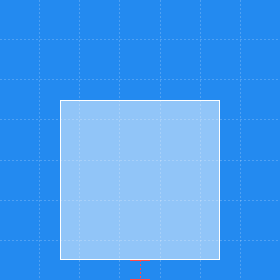
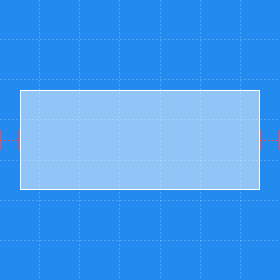
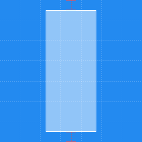
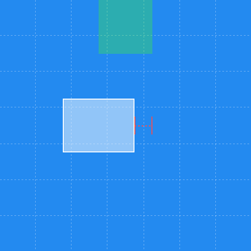
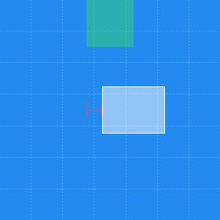

# KGNAutoLayout

`KGNAutoLayout` makes `AutoLayout` easy!

[]()
[]()
[]()
[](/releases)
[](/LICENSE)

[](https://travis-ci.org/kgn/KGNAutoLayout)
[](https://github.com/Carthage/Carthage)
[](https://cocoapods.org/pods/KGNAutoLayout)
[](https://cocoapods.org/pods/KGNAutoLayout)

[](http://twitter.com/iamkgn)
[](https://github.com/kgn)
[](https://github.com/kgn/KGNAutoLayout)

## Installing

### Carthage
```
github "kgn/KGNAutoLayout"
```

### CocoaPods
```
pod 'KGNAutoLayout'
```

## Examples

### Example App

Check out the example app in the project.


### Pin: Superview


``` Swift
let view = UIView()
parentView.addSubview(view)

view.pinToEdgesOfSuperview(offset: 20)
```
--


``` Swift
let view = UIView()
parentView.addSubview(view)

view.pinToTopEdgeOfSuperview(offset: 20)

view.centerHorizontallyInSuperview()
view.sizeToWidthAndHeight(160)
```
--


``` Swift
let view = UIView()
parentView.addSubview(view)

view.pinToRightEdgeOfSuperview(offset: 20)

view.centerVerticallyInSuperview()
view.sizeToWidthAndHeight(160)
```
--



``` Swift
let view = UIView()
parentView.addSubview(view)

view.pinToBottomEdgeOfSuperview(offset: 20)

view.centerHorizontallyInSuperview()
view.sizeToWidthAndHeight(160)
```
--


``` Swift
let view = UIView()
parentView.addSubview(view)

view.pinToLeftEdgeOfSuperview(offset: 20)

view.centerVerticallyInSuperview()
view.sizeToWidthAndHeight(160)
```
--



``` Swift
let view = UIView()
parentView.addSubview(view)

view.pinToSideEdgesOfSuperview(offset: 20)

view.centerVerticallyInSuperview()
view.sizeToHeight(100)
```
--



``` Swift
let view = UIView()
parentView.addSubview(view)

view.pinToTopAndBottomEdgesOfSuperview(offset: 20)

view.centerHorizontallyInSuperview()
view.sizeToWidth(100)
```
--

### Pin: Edges


``` Swift
let itemView = ItemView()
parentView.addSubview(itemView)
itemView.pinToLeftEdgeOfSuperview()
itemView.centerVerticallyInSuperview()
itemView.sizeToWidthAndHeight(60)

let view = LayoutView()
parentView.addSubview(view)

view.pinTopEdgeToTopEdgeOfItem(itemView, offset: 20)

view.centerHorizontallyInSuperview()
view.sizeToWidth(40)
view.sizeToHeight(80)
```
--



``` Swift
let itemView = ItemView()
parentView.addSubview(itemView)
itemView.pinToTopEdgeOfSuperview()
itemView.centerHorizontallyInSuperview()
itemView.sizeToWidthAndHeight(60)

let view = LayoutView()
parentView.addSubview(view)

view.pinRightEdgeToRightEdgeOfItem(itemView, offset: 20)

view.centerVerticallyInSuperview()
view.sizeToWidth(80)
view.sizeToHeight(40)
```
--


``` Swift
let itemView = ItemView()
parentView.addSubview(itemView)
itemView.pinToLeftEdgeOfSuperview()
itemView.centerVerticallyInSuperview()
itemView.sizeToWidthAndHeight(60)

let view = LayoutView()
parentView.addSubview(view)

view.pinBottomEdgeToBottomEdgeOfItem(itemView, offset: 20)

view.centerHorizontallyInSuperview()
view.sizeToWidth(40)
view.sizeToHeight(80)
```
--



``` Swift
let itemView = ItemView()
parentView.addSubview(itemView)
itemView.pinToTopEdgeOfSuperview()
itemView.centerHorizontallyInSuperview()
itemView.sizeToWidthAndHeight(60)

let view = LayoutView()
parentView.addSubview(view)

view.pinLeftEdgeToLeftEdgeOfItem(itemView, offset: 20)

view.centerVerticallyInSuperview()
view.sizeToWidth(80)
view.sizeToHeight(40)
```
--

### Center


``` Swift
let view = UIView()
parentView.addSubview(view)

view.centerInSuperview()

view.sizeToWidthAndHeight(160)
```
--


``` Swift
let view = UIView()
parentView.addSubview(view)

view.centerHorizontallyInSuperview()

view.pinToTopEdgeOfSuperview()
view.sizeToWidthAndHeight(160)
```
--


``` Swift
let view = UIView()
parentView.addSubview(view)

view.centerVerticallyInSuperview()

view.pinToLeftEdgeOfSuperview()
view.sizeToWidthAndHeight(160)
```
--


``` Swift
let view1 = UIView()
parentView.addSubview(view1)
view1.centerVerticallyInSuperview()
view1.sizeToWidthAndHeight(60)

let view2 = UIView()
parentView.addSubview(view2)
view2.centerVerticallyInSuperview()
view2.sizeToWidthAndHeight(80)

let view3 = UIView()
parentView.addSubview(view3)
view3.centerVerticallyInSuperview()
iew3.sizeToWidthAndHeight(50)

parentView.centerViewsHorizontally([view1, view2, view3])
```
--


``` Swift
let view1 = UIView()
parentView.addSubview(view1)
view1.centerHorizontallyInSuperview()
view1.sizeToWidthAndHeight(60)

let view2 = UIView()
parentView.addSubview(view2)
view2.centerHorizontallyInSuperview()
view2.sizeToWidthAndHeight(80)

let view3 = UIView()
parentView.addSubview(view3)
view3.centerHorizontallyInSuperview()
iew3.sizeToWidthAndHeight(50)

parentView.centerViewsVertically([view1, view2, view3])
```
--

### Size


``` Swift
let view = UIView()
parentView.addSubview(view)

view.sizeToWidth(80)

view.sizeToHeight(100)
view.centerInSuperview()
```
--


``` Swift
let view = UIView()
parentView.addSubview(view)

view.sizeToHeight(80)

view.sizeToWidth(100)
view.centerInSuperview()
```
--

## TODO:
- [X] Travis
- [X] Badges
- [X] Tests
- [X] Carthage
- [ ] CocoaPods (Just need to release)
- [ ] Description (Give examples)
- [X] Documentation
- [X] Example App
